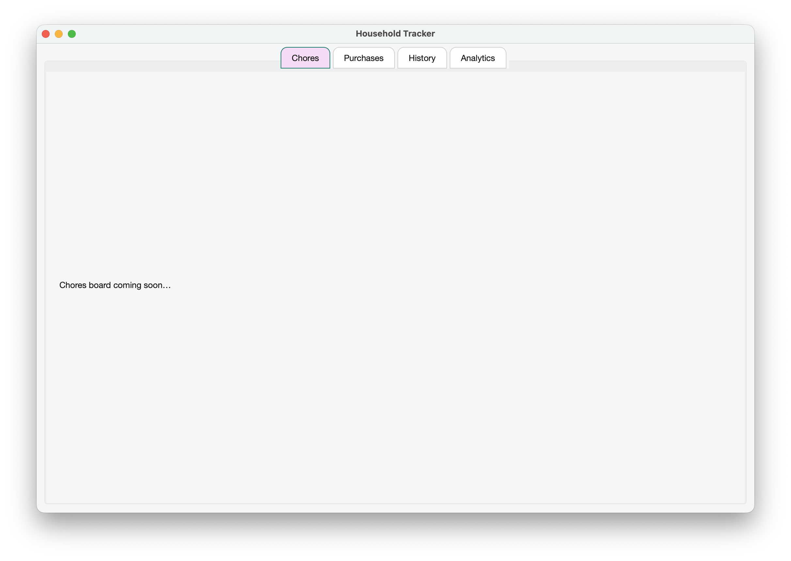

# Household Tracker

A desktop app for Mac built with **Python (PySide6 + SQLite)** to help flatmates fairly track **chores** and **recurring household purchases**.  
The app runs **fully offline**, stores data locally, and provides **analytics dashboards** to keep everything transparent and fair.

---

## Features

### Chores
- Rotate chores fairly between all housemates  
- Log completions with duration + comments  
- View history timeline of who did what and when  
- Analytics: pie charts + leaderboards of time spent  

### Purchases
- Track recurring household purchases (milk, toilet paper, etc.)  
- Rotate who buys each item to ensure fairness  
- Log purchases with quantity, price, and comments  
- Analytics: total spend per user, item breakdowns, pie charts  

### Global
- Works 100% offline — data stored in local SQLite database  
- Light & dark mode stylesheets with rounded, modern design  
- Add/remove users dynamically (rotations auto-adjust)  
- Searchable, filterable history timeline  

---

## Features Implemented So Far

- **Core skeleton app**  
  - Main window with tabs (Chores, Purchases, History, Analytics)  
  - Light & dark QSS themes with rounded modern design  

- **Database foundation**  
  - SQLite + SQLAlchemy models for Users, Chores, Purchases, and completions  
  - Local data storage in `~/Library/Application Support/HouseholdTracker/`  

- **User management (new)**  
  - Added **Users dialog** with table view  
  - Integrated with DB (list users, toggle active, add new users)  
  - Styled table: green headers, zebra rows, consistent selection colors  

- **Dev utilities**  
  - Seeding scripts for test users, chores, and purchases  
  - Repo structure with clean separation (`src/db/repo`, `src/views`, `src/services`)  

---

## Upcoming Features

- Chores board with scrollable widgets and logging  
- Purchases board with logging and analytics  
- Unified history timeline with filtering/search  
- Analytics dashboards (pie charts + leaderboards)  
- Gamification layer (points, streaks, rewards)  

---

## Screenshots
<p align="center">
  
</p>

---

## Tech Stack

- **Language:** Python 3.11  
- **Framework:** PySide6 (Qt for Python)  
- **Database:** SQLite + SQLAlchemy ORM  
- **Visualization:** Matplotlib (planned)  
- **Dev Tools:** Ruff (linting), Black (formatting)  

---

## Getting Started

### 1. Clone the repo
git clone https://github.com/jonahkingcs/household-tracker.git
cd household-tracker

### 2. Set up a virtual environment
```bash
python3 -m venv venv
source venv/bin/activate   # macOS/Linux
venv\Scripts\activate      # Windows
```

### 3. Install dependencies
```bash
pip install -r requirements.txt
```

### 4. Run the app
```bash
python -m src.app
```

---

## Project Structure

HouseholdTracker/
├── src/
│   ├── app.py              # Application entry point
│   ├── views/              # Qt views (MainWindow, future widgets)
│   ├── db/                 # SQLAlchemy models & session setup
│   ├── services/           # Paths, helpers, business logic
│   └── styles/             # QSS stylesheets (light/dark themes)
├── dev/                    # Dev-only scripts (test seeds, etc.)
├── docs/                   # Screenshots, diagrams
└── requirements.txt

---

## Roadmap

- Build chore & purchase widgets
- Implement analytics dashboards
- Add gamification (points, streaks, rewards)
- Export/share reports

---

## License

This project is provided for portfolio and demonstration purposes only.  
All rights reserved — no permission is granted to use, copy, or distribute this code.

---

## Author

**Jonah King**
- [GitHub](https://github.com/jonahkingcs)