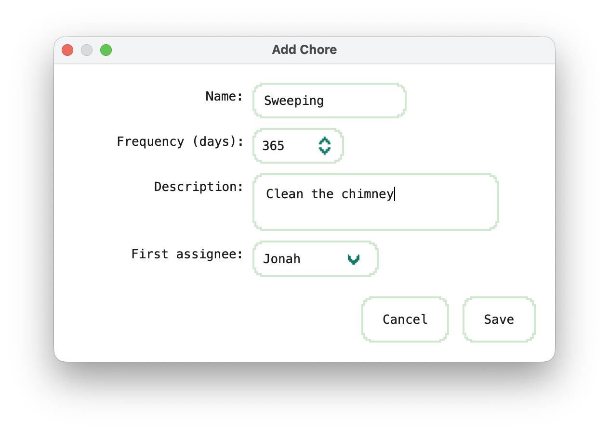
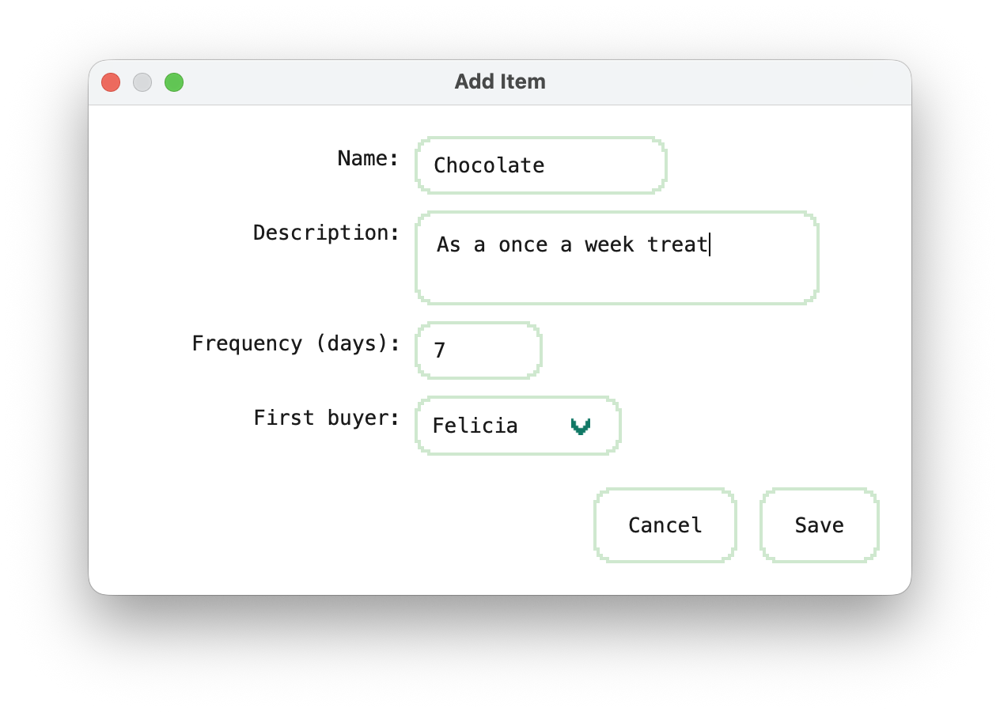

# Household Tracker

A desktop app for Mac built with **Python (PySide6 + SQLite)** to help flatmates fairly track **chores** and **recurring household purchases**.  
The app runs **fully offline**, stores data locally, and provides **analytics dashboards** to keep everything transparent and fair.

---

## Features

### Chores
- Rotate chores fairly between all housemates  
- Log completions with duration + comments  
- View history timeline of who did what and when  
- Analytics: pie charts + leaderboards of time spent  

### Purchases
- Track recurring household purchases (milk, toilet paper, etc.)  
- Rotate who buys each item to ensure fairness  
- Log purchases with quantity, price, and comments  
- Analytics: total spend per user, item breakdowns, pie charts  

### Global
- Works 100% offline — data stored in local SQLite database  
- Light & dark mode stylesheets with rounded, modern design  
- Add/remove users dynamically (rotations auto-adjust)  
- Searchable, filterable history timeline  

---

## Features Implemented So Far

- **Core app & theming**
  - Main window with tabs: **Chores**, **Purchases**, **History**, (Analytics placeholder)
  - **Light/Dark** QSS themes with pixel 9-slice cards/buttons; theme persists via QSettings
  - Quick toggle (Shift+L) and menu: View → Appearance

- **Database & repos**
  - SQLite + SQLAlchemy 2.0 models: `User`, `Chore`, `ChoreCompletion`, `Item`, `PurchaseRecord`
  - Clean repo layer (`src/db/repo/*`) with eager-loading to avoid N+1 queries
  - UUID primary keys; money stored in **cents** for correctness

- **Users management**
  - **Users dialog**: list, add, toggle active, hard delete (with safe reassignment/nulling)
  - Deactivation removes users from rotations; history retained

- **Chores**
  - **Chore board**: scrollable 2-column grid of cards (title, description, due, next assignee)
  - Add/Edit dialogs; **Complete Chore** dialog (duration + comments)
  - Global alphabetical **rotation** of active users; due dates bump via `bump_due`
  - Humanized due text (“Today / Tomorrow / in 3d / Overdue by 2d”)

- **Purchases**
  - **Purchases board**: 2-column cards (restock due, next buyer)
  - Add/Edit item dialogs; **Log Purchase** dialog (qty, price, comments)
  - Rotation advances on purchase; next restock date bumped
  - **Purchases History** tab: table (Item • Buyer • Qty • Total • Date • Comments) with filters  
    (Item, Buyer, Last 30/90 days) and default **Date desc** sorting

- **Dev utilities**
  - Simple seed scripts under `src/dev` for adding users/items/chores/purchases
  - Paths centralized in `src/services/paths.py` (`~/Library/Application Support/HouseholdTracker`)

---

## Upcoming Features

- **History enhancements**
  - Chores history (toggle alongside Purchases)
  - CSV export of filtered history

- **Analytics (MVP)**
  - Total spend per user & per item
  - Chore time leaderboards / completion streaks
  - Simple charts (matplotlib / pyqtgraph / Qt Charts)

- **Rotations & data model**
  - Per-entity rotations (item/chore-specific order vs global)
  - Optional soft-delete & name snapshots for cleaner history

- **Settings & tooling**
  - App Settings panel (currency, date/time format)
  - Data export/import (JSON/CSV)
  - Alembic migrations as the schema stabilizes

- **Packaging**
  - Polished macOS `.app` bundle (codesign/notarize) with PyInstaller/Briefcase

---

## Screenshots
<p align="center">
  
</p>
<p align="center">
  
</p>
<p align="center">
  
</p>
<p align="center">
  
</p>
<p align="center">
  
</p>
<p align="center">
  
</p>
<p align="center">
  
</p>
<p align="center">
  
</p>
<p align="center">
  
</p>
<p align="center">
  
</p>
<p align="center">
  
</p>

---

## Tech Stack

- **Language:** Python 3.11  
- **Framework:** PySide6 (Qt for Python)  
- **Database:** SQLite + SQLAlchemy ORM  
- **Visualization:** Matplotlib (planned)  
- **Dev Tools:** Ruff (linting), Black (formatting)  

---

## Getting Started

### 1. Clone the repo
git clone https://github.com/jonahkingcs/household-tracker.git
cd household-tracker

### 2. Set up a virtual environment
```bash
python3 -m venv venv
source venv/bin/activate   # macOS/Linux
venv\Scripts\activate      # Windows
```

### 3. Install dependencies
```bash
pip install -r requirements.txt
```

### 4. Run the app
```bash
python -m src.app
```

---

## Project Structure

HouseholdTracker/
├── src/
│   ├── app.py              # Application entry point
│   ├── views/              # Qt views (MainWindow, future widgets)
│   ├── db/                 # SQLAlchemy models & session setup
│   ├── services/           # Paths, helpers, business logic
│   └── styles/             # QSS stylesheets (light/dark themes)
│   └── assets/             # Custom icons and ui
│   └── dev/                # Dev-only scripts (test seeds, etc.)
├── docs/                   # Screenshots, diagrams
└── requirements.txt

---

## Roadmap

- Build chore & purchase widgets
- Implement analytics dashboards
- Add gamification (points, streaks, rewards)
- Export/share reports

---

## License

This project is provided for portfolio and demonstration purposes only.  
All rights reserved — no permission is granted to use, copy, or distribute this code.

---

## Author

**Jonah King**
- [GitHub](https://github.com/jonahkingcs)